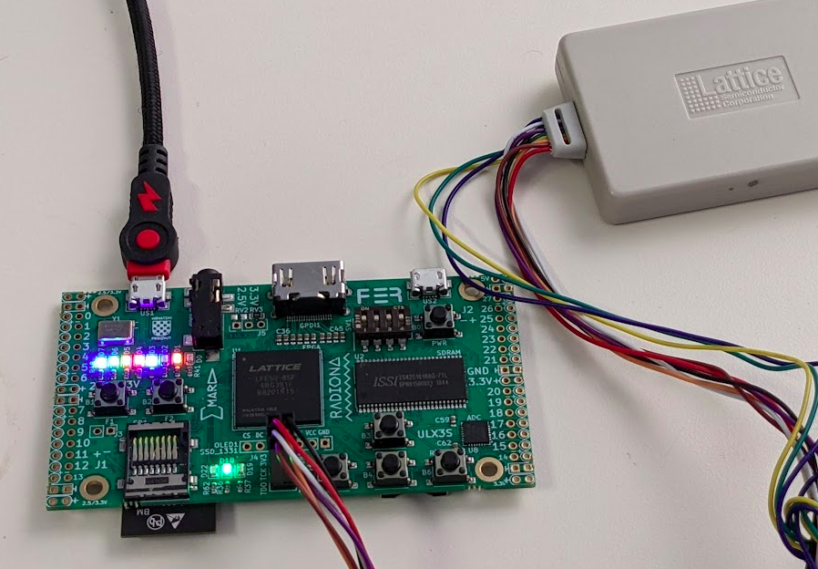
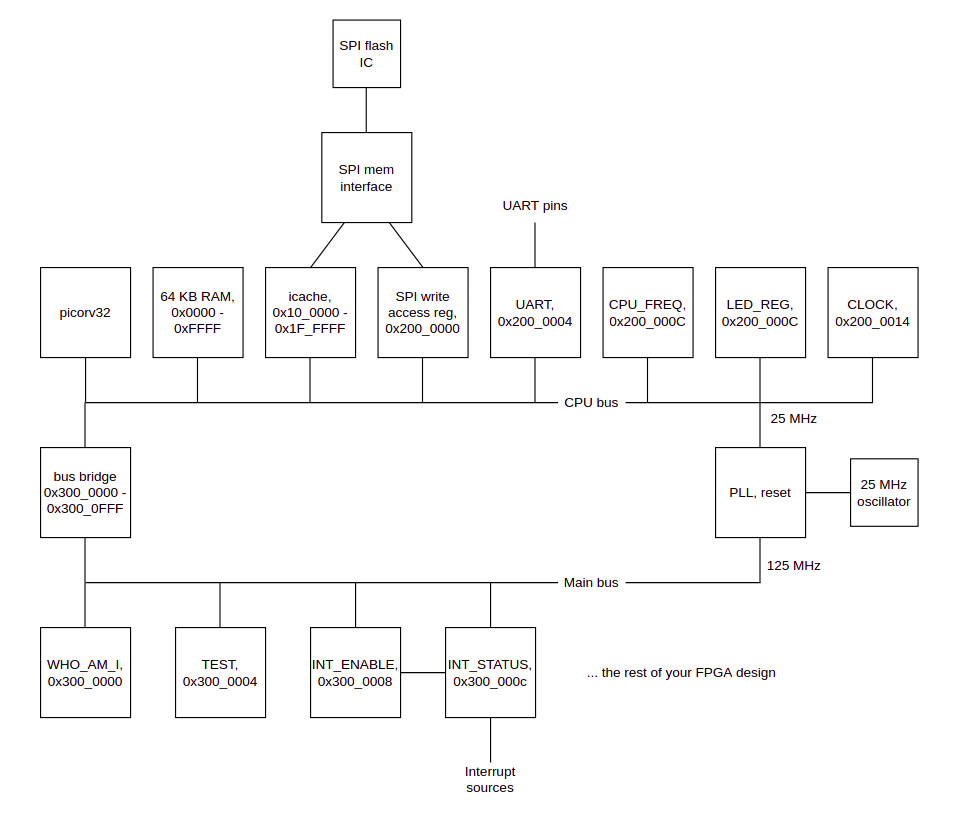

# FPGA-based RISC-V SOC

This is an example of libnklabs running on an FPGA-based SoC.  The processor
is PICORV32- a small RISC-V implementation.  The FPGA is a Lattice
Semiconductor LFE5U-85F-6BG381I (ECP5) on a [ULX3S board](https://www.crowdsupply.com/radiona/ulx3s) from Radiona.

Photo of the board:



The ULX3S board has an FTDI USB to serial adapter IC on it.  The libnklabs
CLI appears on this serial port.

Here is a block diagram of the SoC, showing CPU addresses of each block:



The SPI-flash IC on the ULX3S is used both to store the FPGA .bit file and
to hold the up to 1MB software image for the RISC-V.  Here is a memory map
of the SPI-flash IC:

* 0x000_0000 - ....        FPGA .bit file: the FPGA configured itself from this on power up
* 0x060_0000 - 0x06F_FFFF  Bank 0 firmware
* 0x0E0_0000 - 0x0EF_FFFF  Bank 1 firmware
* 0x0FC_0000 - 0x0FC_FFFF  Database bank 0
* 0x0FD_0000 - 0x0FD_FFFF  Database bank 1
* 0x0FE_0000               Bank select bit (bit 0 of first byte)

The bank select bit indicates which bank will hold the active firmware on
the next reboot.  The idea is that after a firmware update, this bit is
flipped as the last step, after the firmware's CRC has been verified.  If
there is a power outage during an upgrade, the bit will not have been
flipped, so the older firmware is used.

The firmware from the selected bank is mapped to 0x0010_0000 - 0x001F_FFFF. 
An instruction cache speeds access to this bank.  A mechanism is provided for
software to read, write and erase any part of the SPI-flash IC.  The
software must not modify the active bank.  This is sometimes known as
"execute in place".

The SPI-flash IC can be used to store other data beyond the software image
and FPGA .bit file.  The example shows how a database can be stored in the
SPI-flash: this is what the database bank 0 and bank 1 areas are for.

## Other blocks

RAM: 64KB of RAM is provided for the software.  This is implemented using
FPGA block RAMs.

Clock: This is a register that counts CPU clock cycles.  It is used for the
nksched.

UART: A UART with 32-byte receive and transmit FIFOs is provided for the CLI.

The LED_REG is provided to control some ULX3S LEDs.  This is useful for CPU
bringup.  Progress codes are written to these LEDs by the software startup
code.

The CPU_FREQ register hold the CPU frequency in Hz.

There is a bus bridge to the main system bus.  This main bus runs at the
frequency of your main FPGA design.  This allows the cpu bus and main bus to
run at different frequencies.

On the main bus is an identification register, a test read/write register,
and interrupt status and enable regsiters.

PLL supplies the clock for both the CPU bus and the main bus.  ULX3S has a
25 MHz oscillator to feed the PLL.

# Build Instructions

## Environment modules

I highly recommend that you use Environment Modules to manage multiple
versions of vendor software tools.  See:

	http://modules.sourceforge.net/

With environment modules, you can select a particular version of an installed to use:

	module add diamond/3.11

Here is my module file for Lattice Diamond (install as /modulesfiles/diamond/3.11):

	#%Module1.0#####################################################################

	proc ModulesHelp { } {
		global version modroot

		puts stderr "diamond/3.11"
	}

	module-whatis   "Sets the environment Lattice Diamond 3.11"

	# for Tcl script use only
	set     topdir          /opt/lattice/diamond
	set     version         3.11_x64
	set     sys             linux86

	setenv	LSC_DIAMOND		true
	setenv	NEOCAD_MAXLINEWIDTH	32767
	setenv	FOUNDRY			/opt/lattice/diamond/3.11_x64/ispfpga
	setenv	TCL_LIBRARY		/opt/lattice/diamond/3.11_x64/tcltk/lib/tcl8.5

	prepend-path	LD_LIBRARY_PATH		/opt/lattice/diamond/3.11_x64/bin/lin64
	prepend-path	LD_LIBRARY_PATH		/opt/lattice/diamond/3.11_x64/ispfpga/bin/lin64
	prepend-path	LM_LICENSE_FILE 	/opt/lattice/diamond/3.11_x64/license/license.dat

	prepend-path    PATH            /opt/lattice/diamond/3.11_x64/bin/lin64
	prepend-path    PATH		/opt/lattice/diamond/3.11_x64/ispfpga/bin/lin64

## Simulation

I use Icarus Verilog for simulation and gtkwave for waveform viewing:

	sudo apt-get install iverilog
	sudo apt-get install gtkwave

## RISCV toolchain

The picorv32 project has a script to build it, so:

	git clone https://github.com/cliffordwolf/picorv32/tree/v1.0

Follow instructions in README.md file, starting with "make download-tools".

## Lattice Diamond

You need the ULX3S board, you can get one from here:

(https://www.crowdsupply.com/radiona/ulx3s)[https://www.crowdsupply.com/radiona/ulx3s]

You can get the Lattice Diamond software from here:

(https://www.latticesemi.com/en/Products/DesignSoftwareAndIP/FPGAandLDS/LatticeDiamond)[https://www.latticesemi.com/en/Products/DesignSoftwareAndIP/FPGAandLDS/LatticeDiamond]

It's designed for RedHat, but I followed these instructions for installing
Diamond on Ubuntu:

(https://ycnrg.org/lattice-diamond-on-ubuntu-16-04/)[https://ycnrg.org/lattice-diamond-on-ubuntu-16-04/]

(http://timallen.name/index.php/2019/01/14/installing-lattice-diamond-on-ubuntu-18-04/)[http://timallen.name/index.php/2019/01/14/installing-lattice-diamond-on-ubuntu-18-04/]

*NOTE* - Make sure that the tools end up in /opt, e.g.:
```
sudo cp -Rva --no-preserve=ownership ./usr/local/diamond /opt/lattice/ 
```

You will need a license from Lattice.  Your right to it is included with the
purchase of the ECP5 Evaluation Board, but you need to request it from their
web-site.  Once you have the license file, copy it to:

	/opt/lattice/diamond/3.11_x64/license/license.dat

I tried using LSE (Lattice Synthesis Engine) at first, but it was crashing
with mysterious errors, so I switched to Synplify Pro (a high quality logic
synthesis tools included with with Diamond).  But I found that the bash
shell scripts used to launch Synplify reference /bin/sh, which is linked to
"dash" on Ubuntu.  Simple solution is to link /bin/sh to /bin/bash instead
of /bin/dash.

	sudo rm /bin/sh
	sudo ln -s /bin/bash /bin/sh

## Serial Cable

In Windows I am able to use the extra ports of the FTDI FT2232 USB to serial
adapter chip for the embedded programmer as a console UART for the FPGA.  In
Linux, all ports of the FTDI chip become disabled, so this can't be done. 
Worse, the Diamond programmer crashes if you have any other FTDI cable
plugged into your computer.  The solution is to use a Prolific or SiLabs
based USB to serial adapter cable for the serial console.

The serial console cable should be connected to J40:

* K4 is serial output
* P1 is serial input

The baud rate is 115200.  In Linux, I recommend Picocom:

	apt-get install picocom
	sudo picocom --baud 115200 /dev/ttyUSB0

## FPGA build using Makefile

If you are not using environment modules:

	export bindir=/opt/lattice/diamond/3.11_x64/bin/lin64
	source ${bindir}/diamond_env

If you are using environment modules:

	module add diamond

In either case:

	cd fpga
	make

## FPGA build using project file and GUI

Start diamond:

	module add diamond
	diamond &

You should see:


Click on "open project" and select ra.ldf:


The project should open:


Double-click on "Bitstream File" to build the chip:


Eventually it will finish:


Start the programmer with:

	programmer &


The programming should start:


Once the FPGA is programmed, the firmware will start and you should see this
one the serial console:
